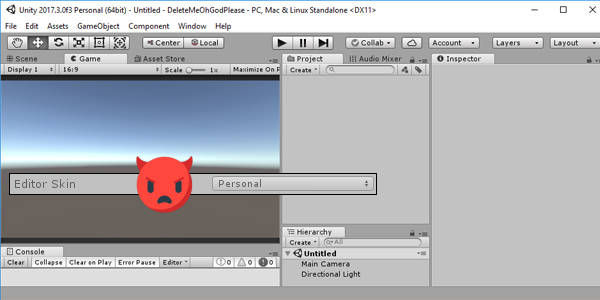
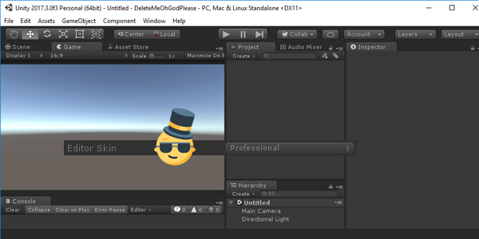

# UNITY3D DARK THEME PATCH
**THIS IS NOT A CRACK**  
All it does is change your theme for accessibility purposes. You do not gain any other premium features.  

⚠`Use at your own risk, if  this tool deletes your computer it is your own fault`⚠  

Want to develop your super successful indie platformer at night? Unity looks like it has never been in the sun before? Your eyes are tearing? If you hate seeing this:  
  
All you gotta do is run this one simple command and agree to nonbinding contract wiht the byte swapper  
  
And you can enjoy the wonders of true darkness (except window chrome which is white for some inexplicable reason). Your eyes would thank you if they could speak, but they got a more important job to do.  
  
Nice and dark, just the way some like it!  

## HOW TO
⚠`Make sure you have read/write permissions for the Unity.exe you are trying to patch`⚠  

1. Run `UnityDarkThemePatch.exe`  
2. If everything is green, type `yes` to apply patch
3. Enjoy dark theme

If you wish to rever to original, repeat the process  
_note:_ the tool creates Unity.exe backup with the format Unity.exe.bakdatetimehere  

If your registry entry for Unity.exe is wrong or nonexistent, drag Unity.exe onto the tool executable. Or run it from terminal with `UnityDarkThemePatch.exe "pathtounityexe"` command to pass the path as argument.  

## SUPPORTED VERSIONS
Windows only, 64 bit only  
* 5.x
* 2017.x up to 2017.3  
Other versions might or might not work but have not been tested

## WHAT DOES IT DO
**TLDR**: finds a byte that is responsible for jump instruction and changes it to a different jump instruction  
The tool opens `Unity.exe` file and searches for this region  
```40 53 48 83 ec 20 48 8b d9 00 00 00 00 00 84 c0 00 08 33 c0 48 83 c4 20 5b c3 8b 03 48 83 c4 20 5b c3```
which is responsible for setting Unity's active skin. Any 0x00 in this case stands for `any byte` because some instructions change between versions more than others.  
The specific jump instruction byte is at offset 16 in this region, it can be either `0x75` if untouched or `0x74` if edited. In this region example it is 0x00 because the tool searches for either patched or unpatched region.  
If the desired region is found and user types `yes`, the skin will either be changed to dark or light, depending on current patch status.  

_Happy developing!_